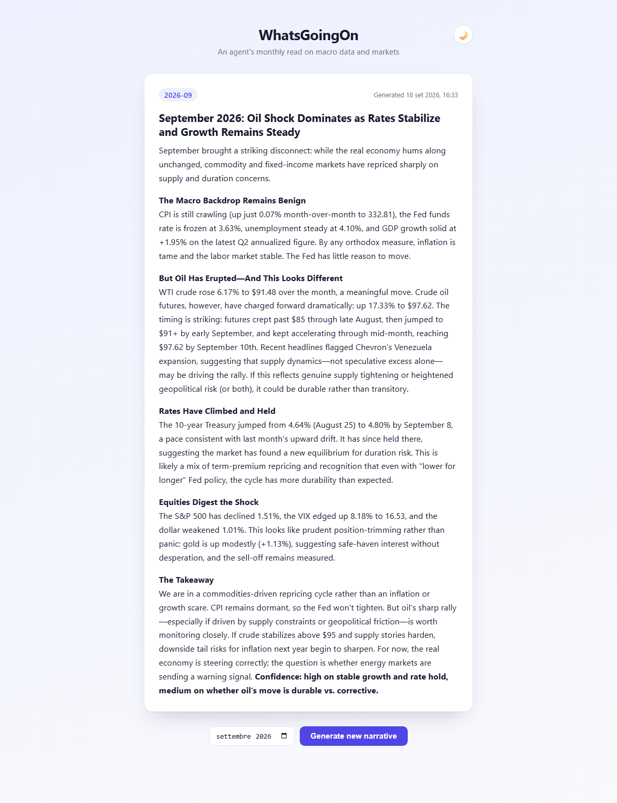

# WhatsGoingOn

Driven by my endless curiosity to understand *WhatsGoingOn* in the world, this project watches a handful of US macro/market indicators, figures out what changed over the last 30 days, and asks Claude to write a narrative explaining what's going on and a local vector store so each month's narrative stays consistent with the last.

## What it does

1. **Ingest** — pulls a handful of FRED macro series (CPI, GDP, Fed Funds Rate, 10Y
   Treasury yield, unemployment, WTI oil) and Yahoo Finance market data (S&P 500, VIX,
   gold, crude oil futures, dollar index) into a local SQLite database.
2. **Agent** — compares the latest value of each series to ~30 days ago, decides (via
   Claude tool calling) whether anything is worth digging into further — a bigger CPI
   sub-component, more history on one series, a news headline — then writes a short
   narrative. Past narratives are stored in a local Chroma collection and the most
   similar ones are pulled back in as context, so the agent doesn't contradict what it
   said last month.

   <details>
   <summary>Example output — September 2026</summary>

   > ## September 2026: Inflation Concerns Resurface as Energy Surges
   >
   > The market's mood shifted noticeably this month as the confluence of rising energy
   > costs, higher bond yields, and a weakening dollar rattled investor confidence. The
   > headline numbers tell a defensive story: equities fell 1.5%, volatility ticked up,
   > and safe-haven gold rose, while the dollar index retreated 1%.
   >
   > The standout mover is oil. WTI crude surged 6.2% month-over-month in the spot
   > price, but futures were far more dramatic—up 17.3% from mid-August to early
   > September. This sharp move suggests geopolitical tension or supply disruption
   > hitting markets hard. The crude price spike is the likely driver behind the
   > 15-basis-point rise in the 10-year Treasury yield to 4.80%, as investors price in
   > renewed inflation expectations. June-to-July CPI was effectively flat at +0.07%,
   > but oil prices moving materially higher now could feed through into broader
   > inflation down the road.
   >
   > The equity selloff appears to be a straightforward response: higher yields
   > compressed valuations (7,636 for the S&P 500 on Sept 9 vs. 7,753 in early August),
   > and the rising energy costs threaten both corporate margins and consumer
   > purchasing power. With the Fed holding rates steady at 3.63% and unemployment
   > stable at 4.1%, there's little immediate policy relief on the horizon. Instead, the
   > market seems to be repricing duration and inflation risk.
   >
   > The dollar's weakness (down to 98.81 from 99.82) is noteworthy and somewhat
   > counterintuitive against rising Treasury yields, but it may reflect expectations
   > that higher commodity prices will eventually force the Fed to move differently
   > than markets originally priced in—possibly toward easing if growth slows—or
   > simply reflects global risk repricing where dollar-denominated commodities become
   > less attractive in dollar terms.
   >
   > **Confidence level: High on the energy shock and its market transmission; medium
   > on whether this reflects temporary disruption or persistent supply issues.** The
   > macro backdrop (solid 1.95% GDP growth, contained inflation so far) suggests
   > fundamentals remain intact, but tail risks around energy costs have visibly moved
   > to the fore.

   </details>
3. **API** — a thin FastAPI wrapper (`GET /state`, `POST /refresh`) around the agent, so
   it can be triggered and read over HTTP instead of only the CLI, plus a minimal demo
   page at `GET /` (latest narrative, its generation timestamp, and a button to
   generate a new one) for a 30-second demo.

   


## Architecture

- **Data layer** (`whatsgoingon/config.py`, `db.py`, `sources/`) — `sources/fred.py` and
  `sources/yahoo.py` each expose a `fetch_series(...) -> list[Observation]`; `db.py`
  holds the shared `Observation` shape and a single SQLite table with an idempotent
  upsert; `ingest.py` wires the two together and is the CLI entry point.
- **Agent layer** (`whatsgoingon/agent/`) — `state.py` computes the 30-day deltas;
  `tools.py` defines the tools the agent can call (query stored observations, fetch an
  additional FRED series, optionally search news); `loop.py` is the hand-rolled
  tool-calling loop; `narrative_store.py` wraps the Chroma collection used for
  month-over-month continuity; `run.py` wires it all together and is the CLI entry
  point.
- **API layer** (`whatsgoingon/api.py`) — FastAPI app exposing the agent over HTTP, plus
  `logging_config.py` for structured (JSON) logs of the agent's tool-calling decisions.

## Status

Data ingestion, the agent loop, the FastAPI wrapper + Dockerfile, and a minimal demo
page are built and tested. CI and an honest write-up of the agent's limitations are not
done yet.

## Getting started

Requires [`uv`](https://docs.astral.sh/uv/) and Python 3.13+.

```bash
uv sync
cp .env
```

Environment variables (`.env`):

| Variable | Required for | Notes |
|---|---|---|
| `FRED_API_KEY` | FRED ingestion | free key at https://fred.stlouisfed.org/docs/api/api_key.html |
| `ANTHROPIC_API_KEY` | the agent / API | |
| `WGO_OBSIDIAN_VAULT_PATH` | optional | folder to also export each narrative to as an Obsidian-vault Markdown note; unset means no export |

Yahoo Finance ingestion needs no key. Without `FRED_API_KEY`, FRED ingestion is skipped
with a warning rather than failing.

```bash
# Pull data into SQLite
uv run whatsgoingon --source all

# Run one agent cycle from the CLI
uv run whatsgoingon-agent

# Or serve it over HTTP -- http://localhost:8000/
uv run whatsgoingon-api
# then: GET /health, GET /state, POST /refresh?month=YYYY-MM
# Phase 2 debate: POST /debate?month=YYYY-MM, GET /debate, GET /debate/YYYY-MM
# interactive docs at http://127.0.0.1:8000/docs

# Or run it in Docker
docker build -t whatsgoingon .
docker run -p 8000:8000 -v wgo_data:/app/data --env-file .env whatsgoingon
```
